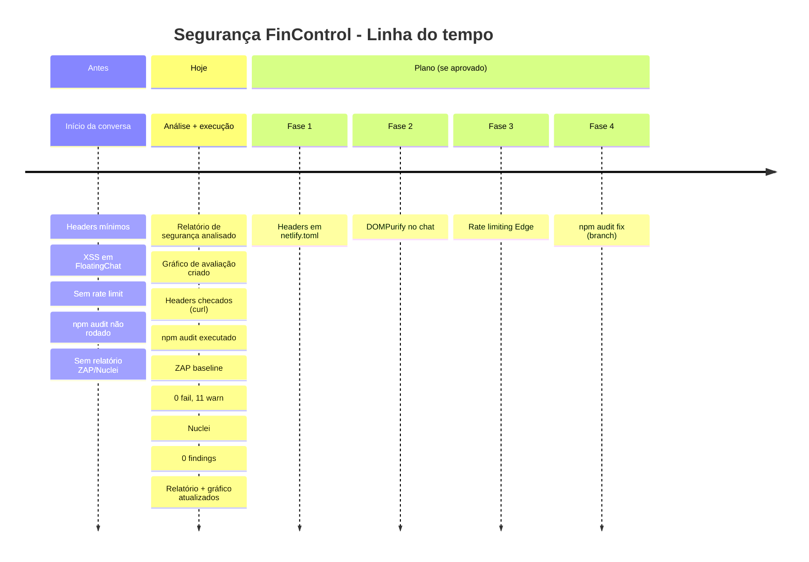
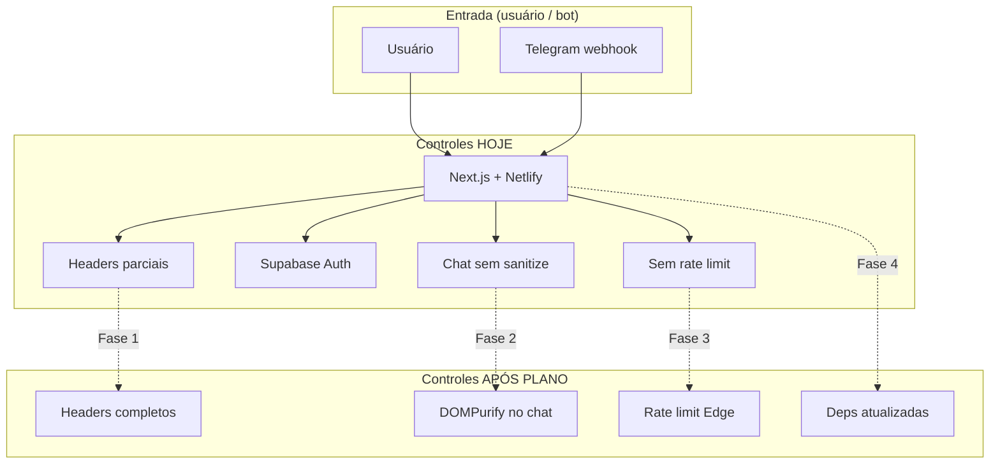

# Diagrama de Segurança — Antes e Depois

Visão do estado de segurança do FinControl desde o início desta conversa até o estado atual e (se aprovado) após o plano de correção.

---

## 1. Visão geral (Mermaid)

```mermaid
flowchart LR
  subgraph ANTES["🔴 ANTES (início da conversa)"]
    A1[Headers HTTP<br>quase nenhum]
    A2[XSS possível<br>dangerouslySetInnerHTML]
    A3[Rate limiting<br>ausente]
    A4[Dependências<br>6 vulns npm]
    A5[Pentest<br>não executado]
  end

  subgraph HOJE["🟡 HOJE (após análise + scans)"]
    B1[Headers: HSTS + X-CTO<br>faltam CSP, X-Frame]
    B2[XSS ainda presente<br>não sanitizado]
    B3[Rate limiting<br>ausente]
    B4[6 vulns npm<br>documentadas]
    B5[ZAP: 0 fail, 11 warn<br>Nuclei: 0 findings]
  end

  subgraph PLANO["🟢 DEPOIS DO PLANO (se aprovado)"]
    C1[Headers completos<br>via netlify.toml]
    C2[XSS mitigado<br>DOMPurify]
    C3[Rate limit<br>Edge + Redis]
    C4[Deps atualizadas<br>em branch/teste]
    C5[Mesmos scans<br>menos avisos]
  end

  ANTES --> HOJE
  HOJE --> PLANO
```



---

## 2. Timeline (antes → hoje → plano)



---

## 3. Scorecard visual (antes vs hoje vs plano)

```mermaid
block-beta
  columns 3
  block:Antes:2
    columns 1
    Headers:1
    XSS:3
    Rate limit:1
    Deps:3
    Pentest:0
  end
  block:Hoje:2
    columns 1
    Headers:2
    XSS:3
    Rate limit:1
    Deps:3
    Pentest:9
  end
  block:Plano:2
    columns 1
    Headers:8
    XSS:8
    Rate limit:7
    Deps:6
    Pentest:9
  end
```

Legenda (0–10): 0 = crítico, 10 = adequado.  
**Antes:** tudo desconhecido ou fraco. **Hoje:** pentest feito (ZAP/Nuclei), resto igual. **Plano:** melhoria em headers, XSS e rate limit; deps com cuidado.

---

## 4. Fluxo dos controles (hoje → após plano)



---

## 5. Resumo em tabela (área de segurança típica)

| Área           | Antes (início)     | Hoje (após conversa)     | Depois do plano (se aprovado)   |
|----------------|--------------------|---------------------------|---------------------------------|
| **Headers**    | Não verificados    | HSTS + X-Content-Type; faltam CSP, X-Frame, Referrer, Permissions | Todos configurados em netlify.toml |
| **XSS**        | Risco identificado | Mesmo risco (FloatingChat) | Mitigado com DOMPurify         |
| **Rate limit** | Ausente            | Ausente                    | Edge + Redis (ex.: 100/min)    |
| **Dependências** | 6 vulns (não vistas) | 6 vulns documentadas      | Reduzidas via audit fix (branch) |
| **Pentest**    | Não feito          | ZAP + Nuclei executados   | Mesmos scans, menos avisos     |
| **Documentação** | Nenhuma            | Relatório, gráfico, ZAP em linguagem simples | Plano de correção avaliado e (opcional) executado |

---

Para ver os diagramas Mermaid renderizados, use um visualizador (VS Code com extensão Mermaid, GitHub, ou [mermaid.live](https://mermaid.live)).
